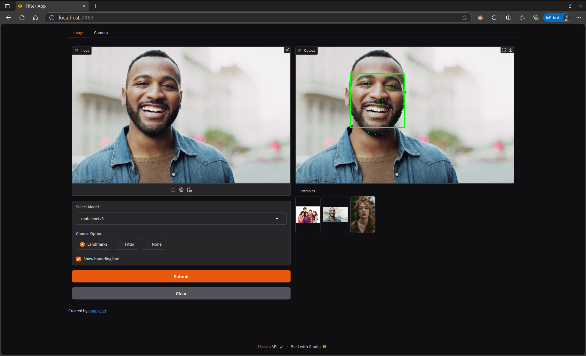
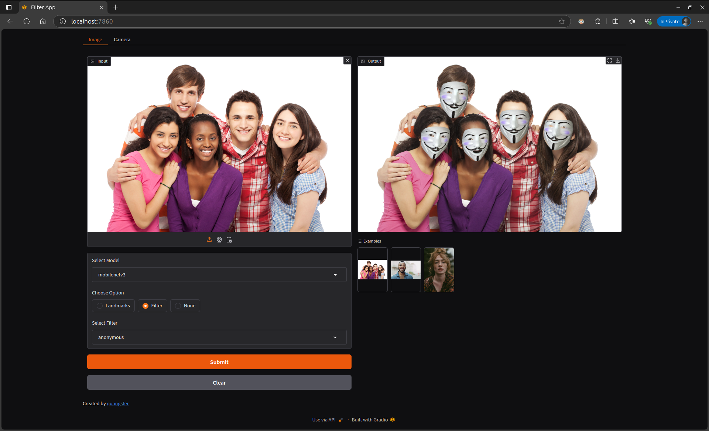

# Face Filter App

This folder contains a face filter application built using **Gradio** for the user interface, **Mediapipe** by Google for face detection, and two models (**ResNet18** and **MobileNetV3**) for detecting keypoints. The app is lightweight and packaged as a Docker image for easy deployment.

- Docker image for Face Filter App: [quangster204/face-filter-app:latest](https://hub.docker.com/r/quangster204/face-filter-app)


## Installation
```bash
cd app/

# install requirements
pip install -r requirements.txt
```

## Run application
### 1. Locally
```bash
python main.py
```
### 2. Docker
```bash
# pull docker images
docker pull quangster204/face-filter-app:latest
# run docker container
docker run -p 7860:7860 quangster204/face-filter-app:latest
```

## Results


